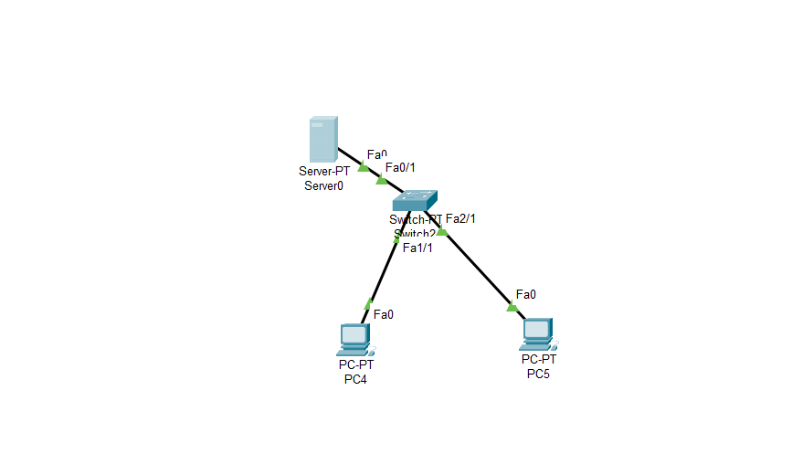
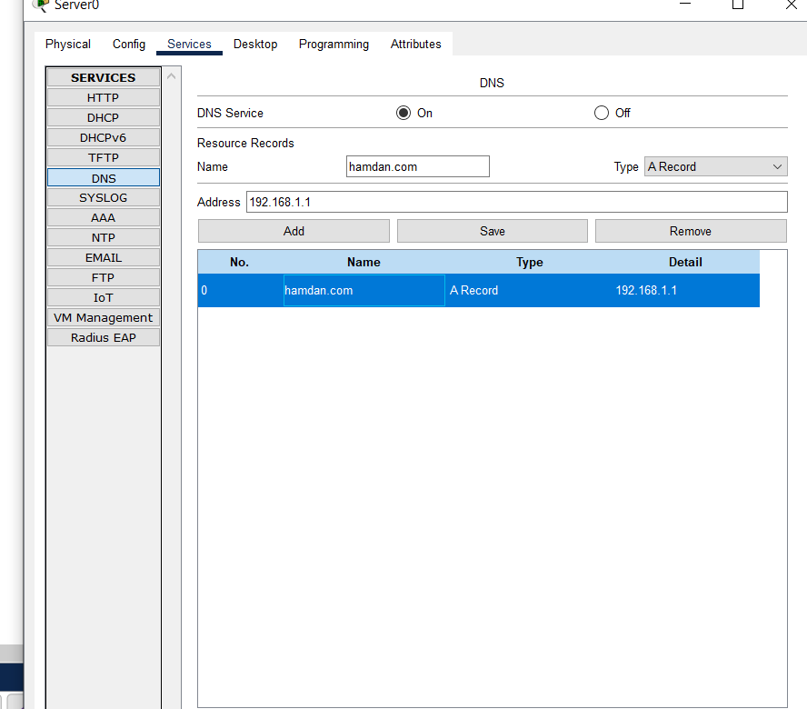
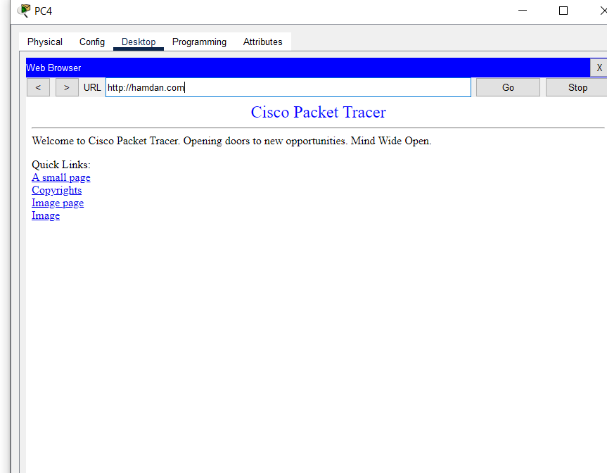
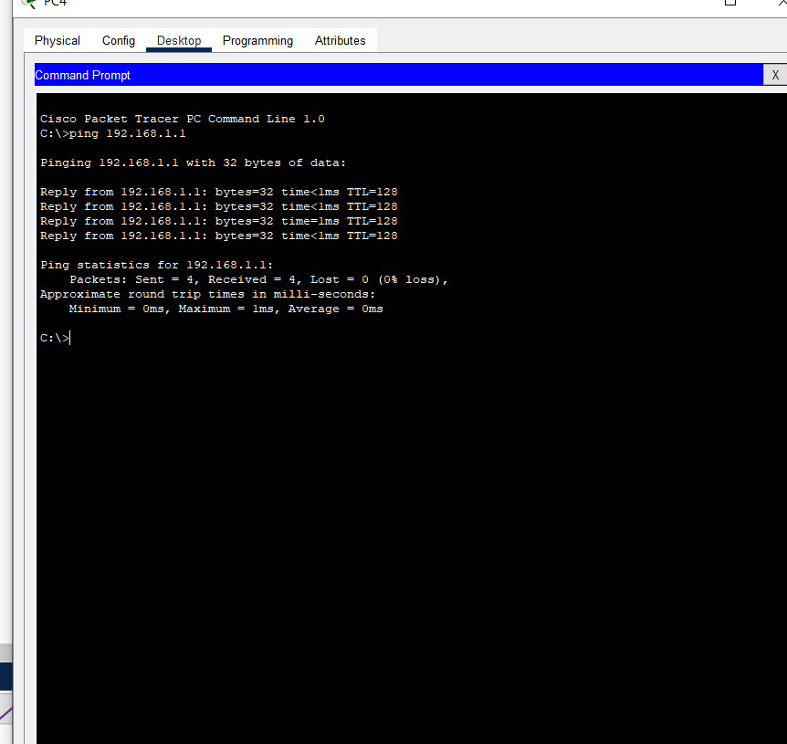

# 🌐 Implementing DNS and HTTP Trace

<div align="center">


*Complete implementation of DNS Server and HTTP Web Server with trace analysis for deep understanding of network communication*

</div>

---

## 📋 Project Description

This project implements a complete network infrastructure demonstrating how DNS (Domain Name System) and HTTP (Hypertext Transfer Protocol) work together in client-server communication. Using Cisco Packet Tracer, this project provides real-time visualization of every packet transmitted in the network.

### 🎯 Learning Objectives

- Understand DNS Query and DNS Response mechanisms
- Analyze HTTP Request and HTTP Response
- Study interactions between application layer protocols
- Master network troubleshooting techniques using trace
- Visualize end-to-end communication flow in networks

---

## 🏗️ Network Architecture

```
┌─────────────┐         ┌─────────────┐         ┌─────────────┐
│   Client    │────────▶│   Router    │────────▶│ DNS Server  │
│  Computer   │         │   Layer 3   │         │ 10.0.0.2/24 │
└─────────────┘         └─────────────┘         └─────────────┘
      │                        │                        │
      │                        │                        │
      └────────────────────────┼────────────────────────┘
                               │
                               ▼
                        ┌─────────────┐
                        │ HTTP Server │
                        │ 10.0.0.3/24 │
                        └─────────────┘
```

### Network Components

| Component | IP Address | Function |
|----------|-----------|---------|
| **Client PC** | DHCP/Static | User accessing the website |
| **Router** | 10.0.0.1/24 | Gateway and inter-network routing |
| **DNS Server** | 10.0.0.2/24 | Domain name to IP address resolution |
| **HTTP Server** | 10.0.0.3/24 | Website and web content hosting |

---

## 🚀 How to Use

### Prerequisites

- Cisco Packet Tracer (version 7.0 or newer)
- Basic understanding of TCP/IP
- `cisco.pkt` file from this repository

### Implementation Steps

#### 1️⃣ **Open Project File**
```bash
1. Launch Cisco Packet Tracer
2. File → Open → Select "cisco.pkt"
3. Wait for topology to load completely
```

#### 2️⃣ **Verify Configuration**
```bash
# On DNS Server
- Ensure DNS Service is active
- Verify A Record is registered
- Check IP address: 10.0.0.2/24

# On HTTP Server  
- Ensure HTTP Service is active
- Verify index.html is available
- Check IP address: 10.0.0.3/24
```

#### 3️⃣ **Testing Connection**
```bash
# From Client PC Command Prompt:
ping 10.0.0.2        # Test connection to DNS Server
ping 10.0.0.3        # Test connection to HTTP Server
nslookup example.com # Test DNS resolution
```

#### 4️⃣ **Accessing Web Server**
```bash
1. Open Web Browser on Client PC
2. Type: http://example.com or http://10.0.0.3
3. Press Enter
4. Observe status: Progress → Success
```

---

## 📊 Status Indicators

This project uses visual feedback to show progress:

### 🔄 **progress.png** - *In Progress*
Displayed when:
- DNS Query is in progress
- Waiting for DNS Response
- HTTP Request is being sent
- Connection is being established
- Data is being transferred

**Progress Stages:**
1. **ARP Request** - Finding gateway MAC address
2. **DNS Query** - Requesting IP from domain
3. **DNS Response** - Receiving IP information
4. **TCP 3-Way Handshake** - SYN → SYN-ACK → ACK
5. **HTTP Request** - GET / HTTP/1.1
6. **HTTP Response** - HTML data transfer

### ✅ **success.png** - *Success*
Displayed when:
- DNS successfully resolves domain to IP
- HTTP connection established
- Web page successfully loaded
- All packets received successfully
- No packet loss or errors

---

## 🔍 Trace Analysis

### DNS Query Process

```plaintext
CLIENT → DNS SERVER
┌─────────────────────────────────────────┐
│ Query Type: A Record                    │
│ Domain: example.com                     │
│ Protocol: UDP                           │
│ Port: 53                                │
│ Flags: Standard Query                   │
└─────────────────────────────────────────┘

DNS SERVER → CLIENT  
┌─────────────────────────────────────────┐
│ Response Code: Success                  │
│ Answer: example.com → 10.0.0.3         │
│ TTL: 3600 seconds                       │
│ Authority: Authoritative Answer         │
└─────────────────────────────────────────┘
```

### HTTP Request/Response Process

```plaintext
CLIENT → HTTP SERVER
┌─────────────────────────────────────────┐
│ Method: GET                             │
│ Path: /index.html                       │
│ Protocol: HTTP/1.1                      │
│ Host: example.com                       │
│ User-Agent: Packet Tracer Browser       │
└─────────────────────────────────────────┘

HTTP SERVER → CLIENT
┌─────────────────────────────────────────┐
│ Status: 200 OK                          │
│ Content-Type: text/html                 │
│ Content-Length: 1024 bytes              │
│ Connection: Keep-Alive                  │
│ Body: [HTML Content]                    │
└─────────────────────────────────────────┘
```

---

## 🧪 Testing Scenarios

### Test 1: DNS Resolution
```bash
Objective: Verify DNS can resolve domain correctly

Steps:
1. Open Command Prompt on Client PC
2. Run: nslookup example.com
3. Expected: Receive reply with IP 10.0.0.3

Result Indicators:
✓ Success: IP address returned correctly
✗ Failure: Request timed out or NXDOMAIN
```

### Test 2: HTTP Connectivity
```bash
Objective: Ensure web server can be accessed via HTTP

Steps:
1. Open Web Browser on Client PC
2. Access: http://example.com
3. Observe progress indicator
4. Verify page loads completely

Result Indicators:  
✓ Success: Web page displayed with success.png
✗ Failure: Connection timeout or error page
```

### Test 3: Ping Test
```bash
Objective: Verify layer 3 connectivity (Network Layer)

Steps:
1. Ping DNS Server: ping 10.0.0.2
2. Ping HTTP Server: ping 10.0.0.3
3. Analyze response time and packet loss

Expected Results:
- Reply from destination
- TTL > 0
- Round-trip time < 100ms
- 0% packet loss
```

---

## 📸 Screenshots

### Network Topology

*Complete Cisco Packet Tracer network diagram showing all devices and connections*

### DNS Resolution in Progress

*DNS query and HTTP request in progress*

### Successful Connection

*Website successfully loaded with success status*

### Ping Test Result

*Connectivity verification using ICMP ping*

---

## 🛠️ Troubleshooting

### Problem: DNS Resolution Failed

**Symptoms:**
- nslookup returns "server can't find domain"
- Browser shows "DNS_PROBE_FINISHED_NXDOMAIN"

**Solutions:**
```bash
1. Verify DNS Server is active
2. Check DNS Service on DNS Server (Services → DNS)
3. Ensure A Record is configured:
   - Name: example.com
   - Address: 10.0.0.3
4. Verify Client is using correct DNS (10.0.0.2)
```

### Problem: HTTP Connection Timeout

**Symptoms:**
- Browser stuck on progress
- Never reaches success state

**Solutions:**
```bash
1. Ping test to HTTP Server: ping 10.0.0.3
2. Verify HTTP Service is active (Services → HTTP)
3. Check firewall or ACL blocking HTTP traffic
4. Ensure index.html exists on HTTP Server
5. Verify TCP port 80 is accessible
```

### Problem: Network Unreachable

**Symptoms:**
- Ping fails with "Destination host unreachable"
- No communication at all

**Solutions:**
```bash
1. Verify cables are connected (link status green)
2. Check IP configuration on each device
3. Ensure subnet mask is correct (255.255.255.0)
4. Verify default gateway on client
5. Check routing table on router
```

---

## 📚 Concepts Learned

### 1. DNS (Domain Name System)
- **Port:** UDP 53
- **Function:** Translates domain names to IP addresses
- **Record Types:** A, AAAA, CNAME, MX, NS, PTR
- **Query Types:** Recursive, Iterative
- **Caching:** Improves performance with TTL

### 2. HTTP (Hypertext Transfer Protocol)
- **Port:** TCP 80 (HTTP), 443 (HTTPS)
- **Methods:** GET, POST, PUT, DELETE, HEAD
- **Status Codes:**
  - 2xx: Success (200 OK, 201 Created)
  - 3xx: Redirection (301, 302)
  - 4xx: Client Error (404 Not Found)
  - 5xx: Server Error (500, 503)

### 3. TCP 3-Way Handshake
```
Client                    Server
  │                          │
  ├────── SYN ──────────────▶│
  │                          │
  │◀────── SYN-ACK ──────────┤
  │                          │
  ├────── ACK ──────────────▶│
  │                          │
  │   Connection Established │
```

### 4. OSI Layer Interaction
```
Application Layer (7)  → HTTP, DNS
Presentation Layer (6) → Data Formatting
Session Layer (5)      → Session Management  
Transport Layer (4)    → TCP, UDP
Network Layer (3)      → IP, ICMP
Data Link Layer (2)    → Ethernet, ARP
Physical Layer (1)     → Cables, Signals
```

---

## 🎓 Learning Outcomes

After completing this project, you will be able to:

✅ Configure DNS Server for domain resolution  
✅ Setup HTTP Web Server for website hosting  
✅ Analyze packet traces for troubleshooting  
✅ Understand DNS and HTTP communication flow  
✅ Identify and resolve network issues  
✅ Design simple network topologies  
✅ Use command line tools for network testing  

---

## 🤝 Contributing

Contributions are welcome! If you want to add features or improve documentation:

1. Fork this repository
2. Create new branch (`git checkout -b feature/AmazingFeature`)
3. Commit changes (`git commit -m 'Add some AmazingFeature'`)
4. Push to branch (`git push origin feature/AmazingFeature`)
5. Create Pull Request

---

## 📝 License

This project is created for educational and learning purposes. Feel free to use and modify according to your learning needs.

---

## 📧 Contact & Support

If you have questions or need help:

- 📧 Email: maliqramirza.mahja@gmail.com
- 💬 Discussion: Open an issue in the repository
- 📖 Documentation: Read this README completely

---

## 🌟 Acknowledgments

- Cisco Packet Tracer for simulation platform
- Networking community for knowledge sharing
- All contributors who helped this project

---

<div align="center">

**⭐ Star this repository if it helps your learning! ⭐**


</div>
